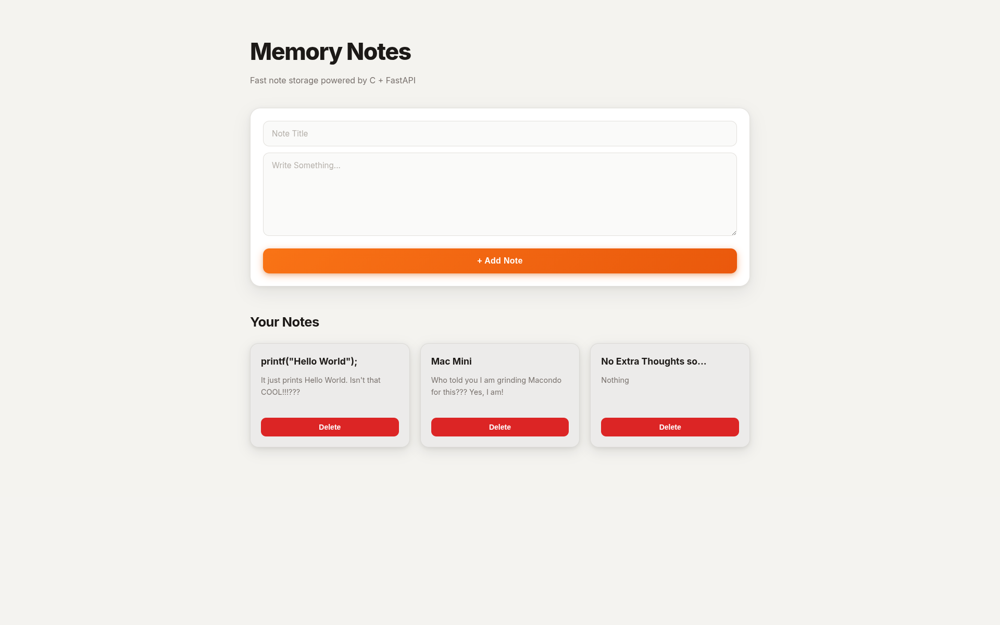

# Memory Notes

A Simple Notes Full-Stack Application which is built with a C Core, FastAPI (Python) Backend and a Traditional HTML/CSS/JS Frontend.

## Stack

- C
- FastAPI
- Python
- Ctypes
- HTML/CSS/JS

## Run

```bash
gcc -shared -fPIC-o libnotes.so src/*.c

cd backend
uvicorn main:app --reload

cd ../frontend
python-m http.server 5500
```

## Features

- Create Notes
- View Notes
- Delete Notes
- C Library Backend

## Learning Goals

- Programming and Handling Extensive Modular Work (Like Handling Many Modular Files and Functions) in C
- Mimicking OOP in C
- Memory Management in C
- File I/O and File Persistence in C
- Shared Libraries
- Ctypes usage in FastAPI
- REST APIs
- Real World Full-Stack Application
- Using Hack Club Nest for Deployment
- Using Docker for Render Deployment

## LICENSE

MIT
